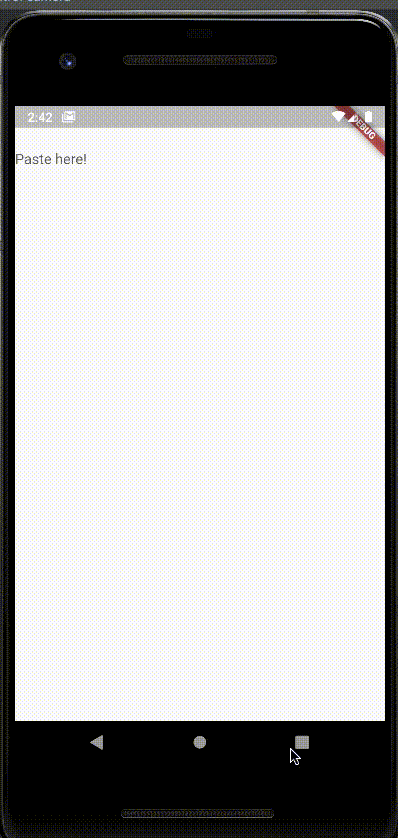

# Original Issue:

[Can't paste into TextField when copying from Samsung Notes, MS Word and MS Excel on Android](https://github.com/flutter/flutter/issues/74320)

# How to improve this issue?

Provide a PlatformPlugin with customize PlatformChannel.
# Result:
 <a href="./result.gif">
  <h1 align="center">
    <picture>
      <source media="(prefers-color-scheme: dark)">
      
    </picture>
  </h1>
</a>

# Will there be other consequences if I change the PlatformChannel's behavior like this?

Please, feel free to give a feedback here if you have any idea.